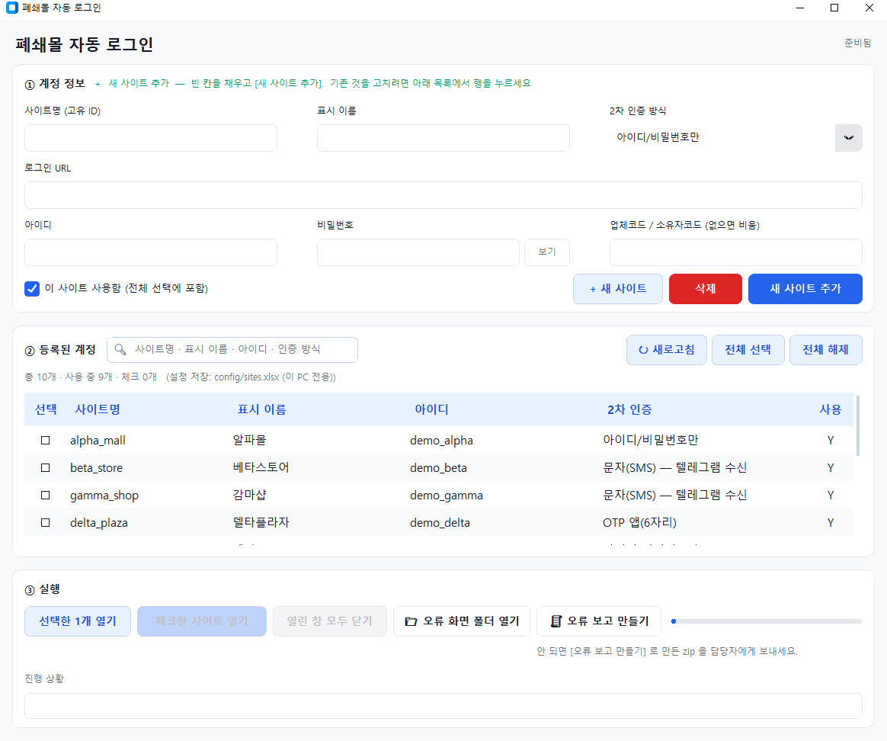

## 폐쇄몰 자동로그인 프로그램

---
**업무명**: 폐쇄몰(SCM) 25개 협력사몰 통합 자동 로그인 시스템 구축
**도구**: Python, Playwright(Chromium), Claude Code(AI 페어코딩), customtkinter(데스크톱 GUI), Telethon(텔레그램 봇 연동), IMAP(메일 인증코드 수신), TOTP/OTP, ddddocr(이미지 캡차 OCR), Google Sheets API(팀 공유), GitHub(자동 배포·업데이트)

**효용**:
- 고용주(대표): 매일 담당자가 25개 몰에 일일이 로그인해 주문을 확인하던 반복 업무를 `--all` 명령 한 번(약 14~20분, 실패 0건)으로 대체. 담당자 1인의 매일 반복 작업을 없애 그만큼 다른 업무에 투입 가능 — 사실상 별도 인력 채용 없이 처리 가능한 업무량이 늘어난 효과.
- 학습자(실무자): "몰마다 아이디·비번 다르고 문자 인증까지 일일이 받아 입력하던" 단순·고빈도 반복 업무에서 벗어남. 인증번호를 놓치거나 비밀번호 변경을 깜빡해 로그인이 막히는 데서 오는 스트레스가 사라지고, 실패해도 원인·해결법이 화면에 바로 뜨므로 "왜 안 되는지 몰라 막막한" 상황이 없어짐.

---

### [작업 내용 & 핵심 결과물]

**어떤 상황인가요?**
협력사 전용 폐쇄몰(SCM) 25곳에서 매일 로그인해 주문을 확인해야 하는데, 사이트마다 인증 방식이 제각각이었습니다(아이디/비번만 있는 곳 10개, 문자인증 10개, OTP 3개, 이메일인증 2개). 사람이 매번 로그인하고, 문자·메일로 오는 인증번호를 직접 보고 입력하는 방식이라 시간이 많이 들고 실수도 잦았습니다.

**핵심 입력 조건**
- 사이트별 계정정보를 담은 엑셀(`config/sites.xlsx`) — 사이트명, 로그인 URL, 아이디/비번, 인증방식(`BASIC`/`SMS`/`OTP`/`EMAIL`) 한 줄씩 추가
- 문자 인증번호를 대신 받아줄 통로: 안드로이드폰의 SMS 포워더 앱 → 텔레그램 봇 채팅방 → 프로그램이 폴링해서 읽음
- 이메일 인증번호 사이트는 IMAP 앱 비밀번호, OTP 사이트는 Base32 시크릿

**최종 해결책**
로그인 화면의 아이디/비번/버튼 위치(선택자)를 사람이 하나하나 지정하지 않고, `auto_detect.py`가 화면에서 자동으로 찾아 로그인한 뒤 **성공한 선택자를 엑셀에 자동 저장**해 다음부터는 재탐지 없이 바로 쓰는 구조로 만들었습니다.

```bash
python main.py --open     # 25개 사이트를 창 하나에 탭으로 열어 검수
python main.py --all      # 창 없이 전체 점검, 끝에 ✅/❌ 요약
```

여기에 사이트별로 다른 문자인증 순서(선인증/후인증/번호전용)를 모두 지원하는 전략 패턴 로그인 엔진, GUI 프로그램(`run_gui.bat`), 팀원 PC 자동 업데이트(GitHub 기반)까지 붙여 담당자가 아이콘 하나만 누르면 되는 상태로 완성했습니다.

**프로그램 메인 화면**



### [학습자용 실무 팁 & 주의점]

**흔히 하는 실수**
- 엑셀에서 전화번호 칸을 '숫자' 서식으로 두면 앞자리 `0`이 사라져(`01062346177` → `1062346177`) 인증문자가 아예 안 옵니다. 반드시 '텍스트' 서식으로.
- `.gitignore`에 `accounts.json  # 비밀번호`처럼 줄 끝에 주석을 달면, 깃이 그 줄 자체를 무시해버려 **비밀번호 파일이 그대로 올라갑니다.** 설명은 반드시 별도 줄에 `#`으로 시작해서 적어야 합니다.
- 새 사이트를 GUI에서만 추가하고 엑셀(`sites.xlsx`)에 행을 안 만들면 "엑셀에 먼저 추가해야 한다"는 안내와 함께 실행이 안 됩니다.

**바로 써먹는 꿀팁**
- 선택자(로그인 버튼 위치 등)는 처음부터 몰라도 됩니다. 비워두고 실행하면 자동 탐지가 찾아서 엑셀에 스스로 저장해줍니다. 실패할 때만 `python main.py --site <사이트명> --probe`로 후보를 확인해 직접 채우면 됩니다.
- 로그인 안 되는 걸 "봇 차단이라 자동화 불가"로 단정하기 전에 세 가지부터 확인: ① 로그인 주소가 낡지 않았는지 ② 로그인 폼을 띄우는 사전 클릭이 필요한지 ③ 2차 인증 설정이 빠졌는지. 실제로 안 되던 사례 대부분이 이 세 가지였습니다.
- 문제가 생기면 사람이 원인을 추측할 필요 없이 `report.bat`을 눌러 로그를 zip으로 묶어 담당자에게 보내는 식으로 처리하도록 만들어, 비전문가도 문제 상황을 그대로 전달할 수 있게 했습니다.

### 그 외에 작업 진행에 대한 프로세스 내용

1. **구조 설계** — 로그인 정보를 코드가 아니라 엑셀(`config/sites.xlsx`) 한 줄로 관리하도록 먼저 설계. 사이트가 추가·변경돼도 코드 수정 없이 엑셀 행만 손대면 되게 함.
2. **엔진 1차 구현** — 아이디/비번(BASIC) 로그인부터 전략 패턴(`LoginStrategy`)으로 구현하고, SK스토아 1개 사이트로 선택자 탐지·자동 저장 구조를 먼저 검증.
3. **인증 유형 확장** — OTP(구글 OTP 시크릿 추출), 문자(SMS, 텔레그램 봇 연동), 이메일(IMAP) 순으로 인증 채널을 하나씩 추가하며 각 유형의 테스트 스크립트(`tests/test_*.py`)도 함께 작성.
4. **25개 사이트 순차 연동 — 실전 디버깅 반복** — 사이트를 하나씩 붙이면서 사이트마다 다른 예외(팝업, iframe, 읽기전용 전화번호칸, 난독화된 버튼 클래스 등)를 부딪히는 대로 자동 처리 로직에 반영. 2026-09-08·09-09 두 차례 전체 점검에서 발견된 함정들을 README에 표로 남겨 재발 방지.
5. **실사용 전환 후 회귀 버그 수정** — 실제 매일 사용을 시작한 뒤에도 "전자랜드 로그인 실패인데 완료로 표시", "코오롱몰 선인증 스킵 회귀", "기프티쇼 비즈 클릭 순서 오류" 등 운영 중 발견된 버그를 커밋 단위로 계속 수정 (Git 커밋 로그가 그대로 유지보수 이력).
6. **비개발자용 GUI·배포 체계 구축** — CLI만으로는 담당자가 쓰기 어려워 `customtkinter` 기반 GUI(`main_gui.py`)를 추가하고, 바탕화면 아이콘 클릭 한 번으로 `실행.vbs → launcher.py`가 GitHub의 최신 코드를 자동으로 받아 실행하는 자동 업데이트 구조를 만들어 팀원 PC에 배포.
7. **오류 대응 체계 정착** — 실패 시 화면 캡처(`error_logs/`)와 원인·해결법을 함께 남기고, 비전문가도 `report.bat` 한 번으로 로그를 묶어 보낼 수 있게 해 유지보수 부담을 개발자 쪽으로만 두지 않도록 설계.
