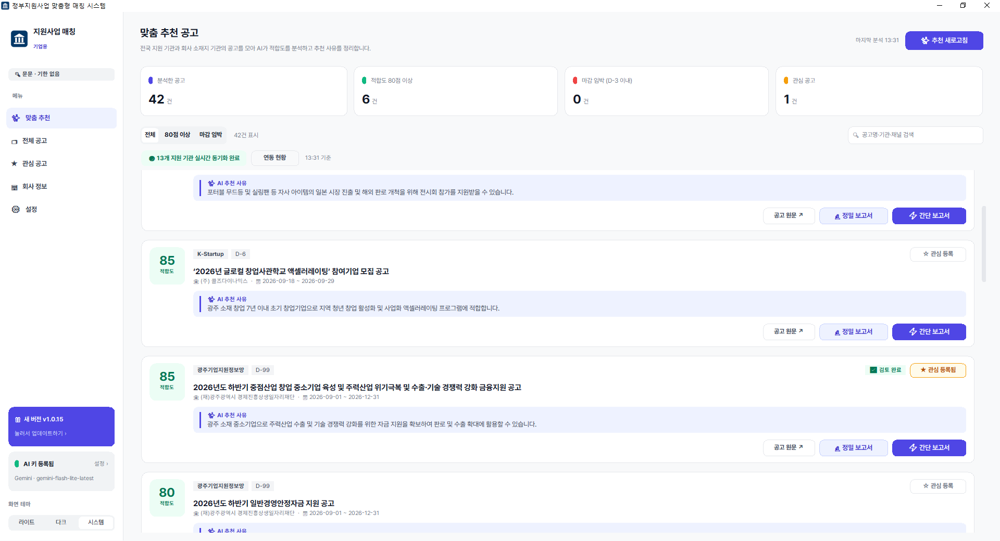

## 정부지원사업 찾기 프로그램

---
**업무명**: 전국 지원기관 공고 자동 수집 + AI 적합도 추천 + 검토 보고서 자동 작성 프로그램 (정부지원사업 맞춤형 매칭 시스템)
**도구**: Python, Claude Code(AI 페어코딩), CustomTkinter(데스크톱 GUI), requests·BeautifulSoup(공고 수집), Google Gemini / OpenAI GPT(적합도 채점·보고서), pydantic(AI 응답 형식 고정), 기업마당 오픈 API, PyInstaller·Inno Setup(설치 파일), GitHub Actions(자동 빌드·자동 업데이트)

**효용**:
- 고용주(대표): 전국 32개 기관 사이트를 사람이 돌며 확인하던 공고 탐색을 버튼 한 번으로 대체. 기관 32곳 전체 수집이 약 25초(144건), 수집한 공고 37건의 AI 채점이 약 15초면 끝남. 회사 소재지·주력 아이템에 맞는 공고만 점수순으로 올라오고, 결재용 간단 보고서도 건당 2~3초에 초안이 나와 공고 검토에 쓰던 담당자 시간을 줄임. 설치 파일과 자동 업데이트까지 갖춰 팀원 PC에서 바로 쓸 수 있는 형태로 완성.
- 학습자(실무자): 기관마다 다른 사이트를 매일 열어 "우리 회사가 해당되나?"를 공고문마다 읽어야 하던 부담이 사라짐. AI가 공고마다 점수와 한 줄 추천 사유를 달아 주므로 80점 이상, 마감 임박 공고부터 보면 됨. 공고를 놓칠지 모른다는 불안이 줄고, 상사 보고용 검토서를 백지에서 쓸 필요도 없어짐.

---

### [작업 내용 & 핵심 결과물]

**어떤 상황인가요?**
정부지원사업 공고는 기업마당, K-Startup, 중진공, 테크노파크, 지역 경제진흥원 등 수십 개 기관에 흩어져 올라옵니다. 담당자가 사이트를 하나씩 돌며 공고를 찾고, 공고문을 읽어 우리 회사의 지역·업종·업력 조건에 맞는지 판단한 뒤, 상사에게 올릴 검토 보고서까지 따로 써야 했습니다. 공고를 놓치거나, 지역 제한 공고를 뒤늦게 알아채는 일이 잦았습니다.

**핵심 입력 조건**
- 회사 정보: 소재지, 주력 아이템, 보유 기술·인증, 희망 지원 분야, 제외 키워드. 회사 소개서·엑셀 파일을 끌어다 놓으면 AI가 항목을 자동으로 채움
- AI 키: Gemini 또는 GPT 중 하나를 앱 [설정] 화면에 입력 (키가 없으면 키워드 규칙 기반 채점으로 자동 전환)
- 소재지에 따라 수집할 지역 기관을 자동으로 고르는 "지역 라우팅" (예: 광주 회사 → 전국 기관 + 광주 기관만 수집)

**최종 해결책**
공고 수집은 기관별 수집기를 표준 공고 규격 하나로 통일하고, AI 채점은 점수 기준과 금지 사항을 못 박은 지시문 + 정해진 JSON 형식(pydantic)으로 받도록 했습니다. 핵심이 된 채점 지시문입니다.

```text
당신은 중소기업 정부지원사업 및 국가 R&D 전문 컨설턴트입니다.
'회사 프로필'과 '지원사업 공고'를 비교해 적합도 점수(0~100)와 한 줄 추천 사유를 작성합니다.
[채점 기준]
- 85~100: 주력 아이템·보유 기술과 직접 연결되고, 소재지·업력 등 자격 요건도 충족
- 65~84 : 희망 지원 분야와 맞고 자격 요건 충족 가능성이 높음
- 40~64 : 간접적으로 활용 가능하거나 자격 요건 확인이 필요함
- 0~39  : 대상 지역·업종·기업 형태가 맞지 않음, 신청기간 종료, 입찰·용역·행정 공지 등 지원사업이 아님
[작성 원칙]
- one_line_reason은 상사가 바로 이해할 수 있는 한국어 1문장(80자 이내)으로 작성
- 회사의 구체적인 아이템·기술과 공고의 어떤 지원 내용이 연결되는지 명시
- 공고에 없는 지원금액·조건을 지어내지 말 것
- 점수가 낮으면 추천 사유 대신 부적합 사유를 1문장으로 작성
- 여러 공고가 주어지면 각 공고를 서로 독립적으로 평가하고, 입력된 모든 번호에 대해 결과를 반환
```

여기에 공고 8건을 한 번에 묶어 채점(무료 한도 대응), 같은 공고는 3일간 점수 재사용(캐시), 12시간마다 자동 갱신, 관심 공고의 간단·정밀 보고서 생성, 설치 파일 한 개로 배포 후 자동 업데이트까지 붙여 담당자가 [추천 새로고침] 버튼만 누르면 되는 상태로 완성했습니다.

**프로그램 메인 화면**



### [학습자용 실무 팁 & 주의점]

**흔히 하는 실수**
- AI 모델 이름을 코드에 박아 두면, 새로 발급한 키로는 옛 모델이 404 오류를 냅니다. 모델명은 설정값·환경변수로 빼 두어야 모델이 바뀌어도 코드 수정 없이 대응할 수 있습니다.
- 공고를 1건씩 AI에 보내면 Gemini 무료 등급 한도(분당 15회)에 바로 걸려 429 오류가 납니다. 8건씩 묶어 보내면 공고 40건을 호출 5번으로 처리할 수 있습니다.
- 전국 통합 사이트에도 "서울 기업만" 같은 지역 한정 공고가 섞여 있습니다. 수집처가 전국이라고 전국 공고로 믿으면 안 되고, 공고마다 실제 신청 가능 지역을 따로 판별해야 합니다.
- AI가 서류에서 뽑은 값(예: 사업자등록증의 개업일을 법인 설립일로 착각)을 그대로 저장하면 틀린 정보가 보고서까지 이어집니다. 자동 추출값은 사람이 확인 화면에서 한 번 보고 채우게 해야 합니다.

**바로 써먹는 꿀팁**
- 프롬프트에 채점 구간(85~100 / 65~84 …)과 "공고에 없는 금액·조건을 지어내지 말 것"을 명시하고, 응답을 정해진 JSON 형식으로 받으면 점수가 들쭉날쭉하거나 없는 내용을 지어내는 문제가 크게 줄어듭니다.
- 사이트가 느리거나 막혀도 사용자 화면에 "실패·오류" 같은 단어를 띄우지 말고, 마지막으로 성공한 수집 결과(캐시)를 보여 주며 "연동 현황"에서만 기관별 상태를 확인하게 하면 사용자가 프로그램 고장으로 오해하지 않습니다.
- 잘 돌아가는 프로그램에 큰 기능을 붙일 때는 "망칠까 걱정되니 실험판을 따로 만들어 보고, 마음에 들면 합치고 아니면 버리자"고 AI에게 요청하세요. 이번에도 정밀 보고서 기능을 실험판에서 먼저 만든 뒤 정식판에 합쳤습니다.
- 기관이 많을 때는 "소재지에 따라 해당 지역 기관만 골라 수집하는 구조로 바꿔 달라"처럼 원하는 구조의 이름을 대괄호로 붙여 요청하면 AI가 설계 의도를 정확히 잡습니다.
- 카드가 수십 개 쌓여 화면이 멈추면 둥근 모서리 위젯 일부를 기본 위젯으로 바꾸고 나눠 그리게 하세요. 멈춤이 약 3.9초에서 0.3초로 줄었습니다.

### 그 외에 작업 진행에 대한 프로세스 내용

1. **초안 코드 검토와 수집 채널 확장 (9/14)** — 기업마당만 수집하던 초안 코드를 Claude Code로 검토한 뒤 K-Startup, SMTECH, IRIS, 중진공, NIPA, 광주 지역 기관 등 8개 채널을 표준 공고 규격으로 통합. 첫 시험에서 8개 채널 117건을 12초에 수집.
2. **AI 채점·보고서와 화면 구성 (9/14)** — Gemini로 적합도 점수와 추천 사유, 결재용 보고서를 만들고 SaaS 스타일 화면으로 정리. 회사 소개 파일 끌어다 놓기, 앱 안 API 설정 화면, Gemini/GPT 선택 기능 추가.
3. **전국 확장과 지역 라우팅 (9/14)** — 16개 시도 기관 수집기를 여러 AI 에이전트가 나눠 병렬로 작성해 32개 기관으로 확장. 소재지에 맞는 기관만 골라 수집하고, 기관별 연동 상태 모니터링과 캐시로 사이트 장애에 대비. 인증서·도메인 변경 등 사이트별 예외를 하나씩 처리.
4. **배포 체계 구축 (9/15)** — 파이썬 설치 없이 "클릭 한 번 설치"가 되도록 설치 파일(exe)을 만들고, 코드를 수정해 올리면 GitHub Actions가 자동으로 빌드해 모든 사용자 프로그램이 스스로 업데이트되는 구조 완성.
5. **실험판에서 보고서 기능 고도화 (9/18)** — 별도 실험판에서 간단 보고서, 관심 공고 폴더, 정밀 보고서(공고문 원문 대조)를 만들고, 회사 세부 정보(인증 만료일·재무·인력·지원 이력)와 서류 넣으면 자동 채우기를 추가. 엑셀 양식 입력 방식은 "너무 어렵다"는 판단으로 서류 끌어다 놓기 방식을 택함.
6. **안정화와 정식 반영 (9/21)** — 분석 결과 저장·복원, AI 점수 캐시, 12시간 자동 갱신을 넣고 실험판을 정식판에 합침(v1.0.14). 설정 방법을 알려 주는 환경변수 예시 파일도 추가.
