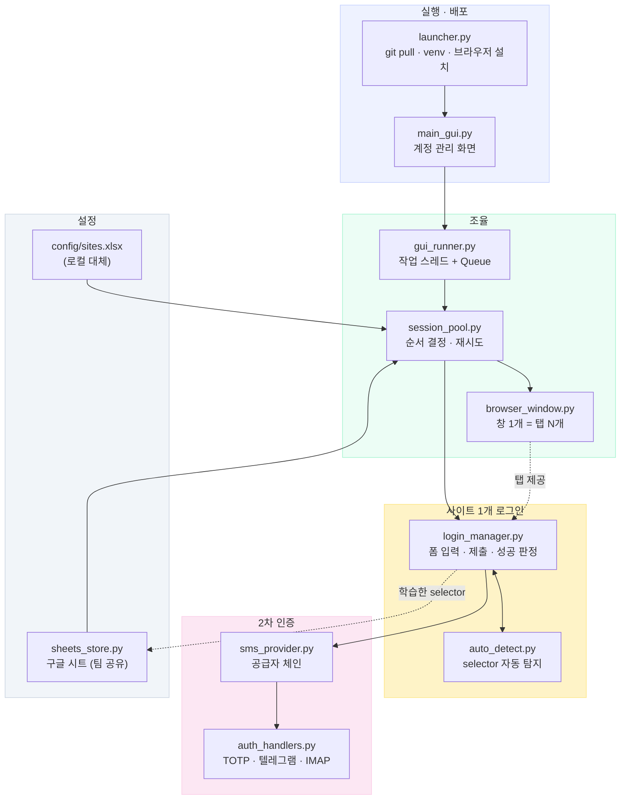
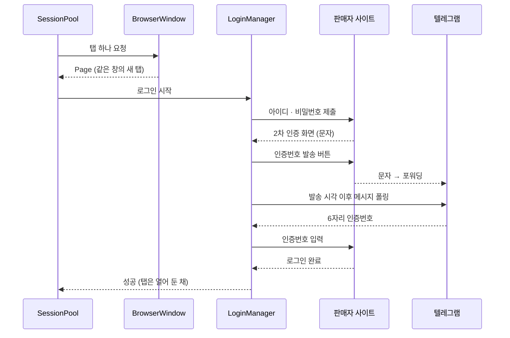

# 폐쇄몰 자동 로그인 (Closed-Mall Auto Login)

**B2B 입점몰 25곳의 관리자 로그인을, 문자·OTP·메일 인증까지 포함해 사람 손 없이 끝내는 데스크톱 도구.**

매일 아침 25개 판매자 사이트에 하나씩 로그인하던 일 — 아이디/비밀번호를 넣고, 문자 인증번호를 폰에서 옮겨 적고, OTP 앱을 열어 6자리를 확인하는 반복 작업 — 을 버튼 하나로 대체했습니다.
브라우저 창 하나에 25개 사이트가 탭으로 열린 상태로 끝납니다. **실측 17분, 성공률 25/25, 사람이 개입한 횟수 0회.**


---

## 무엇이 어려웠나

단순 매크로가 아니라, 25개 사이트가 각기 다르게 구는 것을 흡수하는 게 일의 대부분이었습니다.

| 문제 | 해결 |
|---|---|
| 사이트마다 인증 방식이 다름 | `BASIC` / `OTP` / `SMS` / `EMAIL` 4가지를 전략으로 분리해 사이트별로 선택 |
| **문자 인증번호를 사람이 옮겨 적어야 함** | 폰의 문자를 텔레그램으로 포워딩 → Telethon으로 그 대화방을 읽어 6자리 추출. 발송 시각 이후 도착분만 인정하고, 재발송 번호가 오면 최신 것을 씀 |
| 로그인 폼 selector가 사이트마다 다르고 수시로 바뀜 | 못 찾으면 화면을 훑어 후보를 **자동 탐지**하고, 성공한 selector를 설정에 **되먹임 저장** |
| 같은 계정으로 동시 로그인하면 서로 밀어냄 | 호스트 단위로 순서를 지키고, 중복 로그인 팝업은 자동 처리 |
| 창이 25개 떠서 검수가 불편 | 컨텍스트 하나를 공유해 **한 창의 탭**으로 모음. 쿠키가 충돌하는 사이트만 창을 분리 |
| 팀원 PC에서만 실패하는데 원인이 안 보임 | 실패 순간의 화면·DOM·오류를 zip으로 묶는 **오류 보고** 기능. 비밀번호는 제외 |
| 배포한 PC마다 환경이 제각각 | 설치 스크립트가 Python·Git까지 무인 설치. 실행할 때마다 최신 코드를 스스로 받아옴 |

---

## 핵심 기능

- **4가지 인증 자동 처리** — 아이디/비밀번호, TOTP(구글 OTP), 문자(SMS), 메일 인증코드
- **문자 인증 무인화** — 텔레그램 경유로 인증번호를 읽어 자동 입력. 안 오면 재발송을 한 번 누르고, 그래도 안 되면 일단 넘어간 뒤 나머지가 끝나고 재시도
- **selector 자동 탐지 + 학습** — 화면 구조가 바뀌어도 후보를 찾아내고, 성공한 값을 설정에 저장해 다음부터 바로 씀
- **탭 모드** — 25개 사이트가 브라우저 창 하나에 탭으로. `Ctrl+Tab` 으로 검수
- **GUI** — 계정 등록·수정·검색, 체크한 사이트만 열기, 진행 로그 실시간 표시
- **팀 공유** — 계정·사이트 설정을 구글 시트에 두면 팀원 전체가 같은 설정을 봄
- **자동 업데이트** — 실행할 때마다 최신 코드를 받아옴. 팀원은 아이콘만 누르면 됨
- **자가 진단** — `doctor.py` 가 파이썬·패키지·브라우저·인증 설정·시트 연결을 한 번에 점검
- **오류 보고** — 실패 화면과 DOM을 zip으로. 비밀번호·토큰·세션 파일은 자동 제외

---

## 기술 스택

| 분야 | 사용 기술 |
|---|---|
| 언어 | Python 3.10+ |
| 브라우저 자동화 | **Playwright** (Chromium, Sync API, persistent context) |
| 데스크톱 UI | **customtkinter** (Tkinter 기반), 작업 스레드 + Queue로 UI 블로킹 방지 |
| 인증 | **pyotp** (TOTP), **Telethon** (텔레그램 계정으로 문자 수신), `imaplib` (메일 인증코드), **protobuf** (구글 OTP 마이그레이션 QR 디코딩) |
| 데이터 | **gspread + google-auth** (구글 시트 팀 공유), **openpyxl / pandas** (xlsx) |
| 기타 | **ddddocr** (이미지 캡차 OCR), `winrt` (Windows 알림에서 문자 읽기), python-dotenv |
| 배포 | Git 기반 자동 업데이트, winget을 쓰는 무인 설치 스크립트 |

규모: 애플리케이션 코드 약 7,900줄 + 테스트 약 1,800줄 (Python 39개 파일)

---

## 아키텍처



### 로그인 한 번의 흐름



핵심 설계 판단 세 가지:

1. **탭을 한 창에 모으려면 브라우저 컨텍스트가 하나여야 하고, Playwright Sync API 객체는 만든 스레드에서만 다룰 수 있다** → 워커 스레드 병렬 로그인을 포기하고 순차로 전환했습니다. 전체 시간의 대부분은 어차피 순차로 처리해야 하는 문자 인증 사이트가 차지하므로, 실제 손해는 약 2분이었습니다.
2. **창 하나 = 쿠키 한 벌** → 같은 호스트에 계정만 다른 사이트는 서로를 로그아웃시킵니다. `group_by_host()` 가 충돌하는 것만 별도 창으로 분리해 창 수를 최소로 유지합니다.
3. **창 하나가 여러 사이트를 담으면 그 창이 닫힐 때 남은 전부가 실패한다** → 컨텍스트의 `close` 이벤트를 잡아 그 자리에서 중단합니다. 그러지 않으면 오류 자료 수십 벌이 쌓여 진짜 원인이 묻힙니다.

---

## 설치 및 실행

### 준비물

- Windows 10 이상
- Python 3.10 이상 — 없으면 `setup.bat` 이 winget으로 설치합니다

### 설치

```bash
git clone https://github.com/MOONMOONCHOI/autologin.git
cd autologin

python -m venv .venv
.venv\Scripts\activate
pip install -r requirements.txt
playwright install chromium
```

또는 `setup.bat` 을 더블클릭하면 위 과정을 한 번에 처리합니다.

### 설정

```bash
copy .env.example .env      # 텔레그램 · 메일 · 구글 시트 값을 채운다
python create_template.py   # config/sites_template.xlsx 생성 → 복사해서 사이트 등록
```

`.env` 의 각 항목이 무엇이고 어디서 발급받는지는 `.env.example` 주석에 적혀 있습니다.

### 실행

```bash
python main_gui.py                           # 화면으로 계정 관리 + 로그인 (= run_gui.bat)
python main.py --open                        # 전체 사이트를 탭으로 열어두기 (= open_all.bat)
python main.py --site alpha_mall --keep 20   # 한 사이트만 테스트
python doctor.py --fix                       # 환경 진단 (안 될 때)
```

`run.bat` 을 실행하면 위 기능을 번호로 고르는 메뉴가 뜹니다.

### 테스트

```bash
python tests/test_core.py
python tests/test_sheets_store.py
python tests/test_retry.py
```

---

## 문서

| 문서 | 내용 |
|---|---|
| [docs/운영-매뉴얼.md](docs/운영-매뉴얼.md) | 전체 설계·설정·트러블슈팅 (사이트별 대응 기록 포함) |
| [사용법과 주의사항.txt](사용법과%20주의사항.txt) | 실사용자용 안내 |
| [배포와 자동업데이트.md](배포와%20자동업데이트.md) | Git 기반 자동 업데이트 구조 |
| [다른 회사에서 쓰기.md](다른%20회사에서%20쓰기.md) | 다른 환경에 이식할 때 바꿔야 할 것 |

---

## 참고

- 이 저장소는 실제 운영 중인 도구에서 **계정·연락처·사업자번호·회사명·내부 저장소 주소를 모두 치환한 공개본**입니다. 치환은 `scripts/make_public_package.py` 가 자동으로 수행하며, 결과물에 식별 정보가 한 글자라도 남으면 빌드를 중단합니다.
- 화면 캡처의 사이트·계정은 시연용 가상 데이터입니다.
- `.env`, `accounts.json`, `config/sites.xlsx`, 브라우저 프로필, 텔레그램 세션은 저장소에 포함되지 않습니다.
